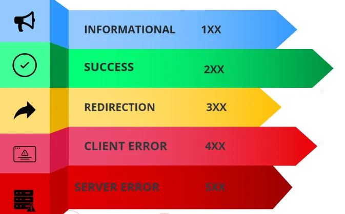

# Introducción a APIs y Servicios en .NET

## 1. Introducción a MVC y MxC

### MVC (Model-View-Controller)
- **Model**: Gestiona los datos y la lógica de negocio.
- **View**: Presenta la información al usuario (solo en aplicaciones web o escritorio).
- **Controller**: Intermediario que gestiona las solicitudes del usuario.

### MxC (Model-[Sin]View-Controller)
- **Model** y **Controller** se mantienen.
- **No hay vistas en las APIs**: Las APIs no generan interfaces gráficas, sino que devuelven datos, normalmente en formato JSON o XML.

**Nota**: Las APIs REST se centran en la **transferencia de datos**.

---

## 2. ¿Qué es una API REST?

- **Definición**: API (Interfaz de Programación de Aplicaciones) que sigue los principios REST (Transferencia de Estado Representacional).

### Características:
- **Stateless**: No guarda estado entre solicitudes.
- **Formatos comunes**: JSON o XML.
- **Verbos HTTP**: Utiliza métodos como GET, POST, PUT, DELETE.

### ¿Qué implica?
- Comunicación entre sistemas (frontend y backend, o entre servicios).
- Permite crear servicios escalables y reutilizables.


### [Lectura complementaria](https://www.arquitecturajava.com/que-es-rest/)

<div align="center">
    
</div>
---

## 3. ¿Qué son los Códigos HTTP?

- **Definición**: Los códigos HTTP son respuestas estándar proporcionadas por servidores web a solicitudes realizadas por un cliente (navegador o servicio).

### Clasificación de Códigos HTTP:
- **1xx (Informativos)**: La solicitud fue recibida y el proceso continúa.
- **2xx (Éxito)**: La solicitud se ha procesado correctamente.
- **3xx (Redirección)**: El cliente necesita tomar más acciones para completar la solicitud.
- **4xx (Errores del Cliente)**: Hubo un problema con la solicitud.
- **5xx (Errores del Servidor)**: El servidor falló en procesar una solicitud válida.


### [Lectura complementaria](https://mrando-via.medium.com/c%C3%B3digos-http-a312b8ad6f72)

<div align="center">
    
</div>

---

## 4. Códigos HTTP Comunes en un CRUD

### Códigos de Éxito:
- **200 OK**: Solicitud exitosa.
- **201 Created**: Recurso creado.

### Códigos de Error:
- **400 Bad Request**: Datos inválidos.
- **404 Not Found**: Recurso no encontrado.
- **500 Internal Server Error**: Error en el servidor.

### Ejemplos en CRUD:
- **GET**: 200 OK (recuperación de recursos).
- **POST**: 201 Created (nuevo recurso).
- **PUT/PATCH**: 200 OK o 204 No Content (actualización exitosa).
- **DELETE**: 204 No Content (recurso eliminado).

---

## 5. Middleware en .NET

- **Definición**: Middleware es un componente de software que se ejecuta entre el servidor y las solicitudes del cliente.
- **Función**: Procesa solicitudes HTTP, maneja la autenticación, registro de errores, etc.

### Ejemplos:
- Autenticación (validar usuarios).
- Registro (logging) de solicitudes.
- Manejo de excepciones (errores).

### Código Ejemplo:
```csharp
public void Configure(IApplicationBuilder app)
{
    app.UseMiddleware<CustomMiddleware>();
}

```
### [Lectura complementaria](https://learn.microsoft.com/es-es/aspnet/core/fundamentals/middleware/?view=aspnetcore-8.0)

---

## 6. Inyección de Dependencias (DI)

- **Definición**: Técnica que permite que los objetos reciban sus dependencias (otros objetos) desde el exterior en lugar de crearlas ellos mismos.

### Beneficios:
- Desacoplamiento de clases.
- Facilita el testeo y mantenimiento.

### Ejemplo de DI:
```csharp
public class AutorController {
    private readonly IAutorService _autorService;

    public AutorController(IAutorService autorService) {
        _autorService = autorService;
    }
}
```

---

## 7. Interfaces en .NET

- **Definición**: Contratos que definen qué métodos debe implementar una clase, pero no cómo.

### Beneficios:
- **Abstracción**: Oculta los detalles de implementación.
- **Flexibilidad**: Permite cambiar la implementación sin afectar el código que usa la interfaz.
- **Testeo**: Facilita la creación de mocks para pruebas.

### Ejemplo:
```csharp
public interface IAutorService {
    Autor GetAutor(int id);
    Autor Create(Autor autor);
    void Delete(int id);
}
```
